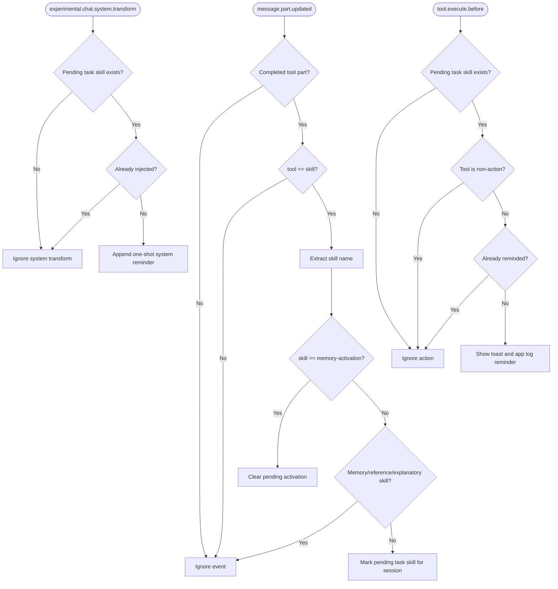

# Memory Activation Reminder Hook

## 读者与目的

本文档面向维护 OpenCode hook 的 agents 和维护者。阅读它可以理解这个 hook 负责什么、不负责什么，以及如何避免 `memory-activation` 提醒循环。

## 职责边界

这个 hook 是一个软提醒机制。它不会自动运行 memory tools，不会阻塞工具执行，也不会复制 `memory-activation` skill 的工作流。它只负责发现 action-oriented skill 已加载，并向 agent 注入一次可见的 system reminder，提醒 agent 在行动前加载或应用 `memory-activation`。

`memory-activation` skill 负责真正的 recall workflow：如何构造 query、何时 retry、何时 smart-search、如何 adopt、ignore 或 defer memory 结果。

## 决策树



## 状态模型

状态按 session 隔离：

```text
pendingBySession[sessionID] = {
  skill: string,
  injected: boolean,
  reminded: boolean
}
```

- 加载 `memory-activation` 会清除该 session 的 pending state。
- 加载 skiplist 中的 memory/reference skill 不会创建 pending state。
- 加载其它 skill 会创建 pending state。
- 下一次 `experimental.chat.system.transform` 会向 `output.system` 注入一次 agent-visible reminder。
- 下一次 non-action tool 会被忽略。
- 下一次 action tool 会触发 human-visible toast 和 app log 备份提醒。
- 每次 pending skill load 最多注入一次 system reminder，也最多触发一次 toast/log reminder。

## Skip Lists

这些 skills 不受监督，因为它们本身管理 memory，或只是解释 reference material：

```text
memory-activation
agentmemory-mcp-tools
forget
lesson
memory-discipline
recall
recap
remember
session-history
```

这些 tools 在 toast/log reminder 触发前允许执行：

```text
skill
agentmemory_memory_lesson_recall
agentmemory_memory_recall
agentmemory_memory_smart_search
```

## Agent Reminder Text

hook 会向 `output.system` 追加一次这段文本：

```text
[Memory activation reminder]
You loaded task-specific/action skill "<skill>" but have not applied memory-activation yet. Before acting, load/apply memory-activation, or explicitly state why it is skipped for this task.
```

## Human And Log Reminder Text

hook 也会显示 toast 并写入 app log：

```text
Loaded task skill "<skill>" without applying memory-activation. Load/apply memory-activation before acting, or state why it is skipped.
```

## 非目标

- 不自动运行 `memory_lesson_recall`。
- 不阻塞 `bash`、文件编辑或外部资源操作。
- 不判断 recall query 是否足够好。
- 不在 hook 中复制 `memory-activation` skill 的 workflow。
- 不把 `memory-activation` 当作 task skill；它必须清除 pending state。

## 已知限制

这个 MVP 通过完成态的 `skill` tool part 识别 skill load，注入一次 agent-visible system reminder，并在下一个 action tool 前保留 toast/log 作为 human-visible 备份。它不能证明 agent 真的把 memory 采纳进计划；这仍然由 `memory-activation` skill 和全局 `Memory Activation` 规则负责。
